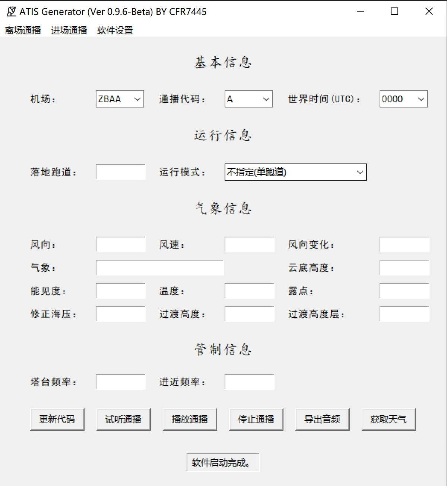
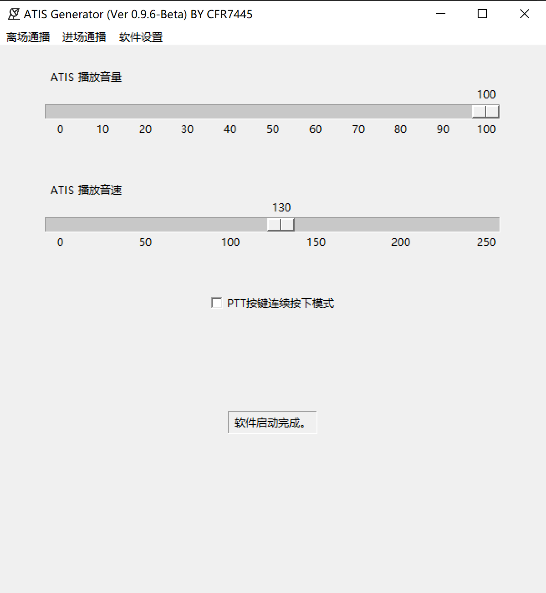
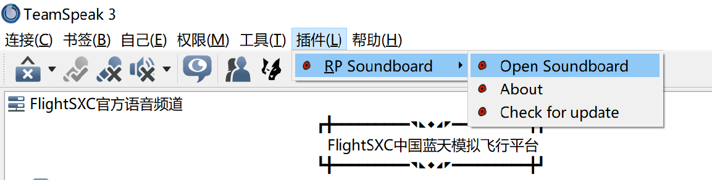
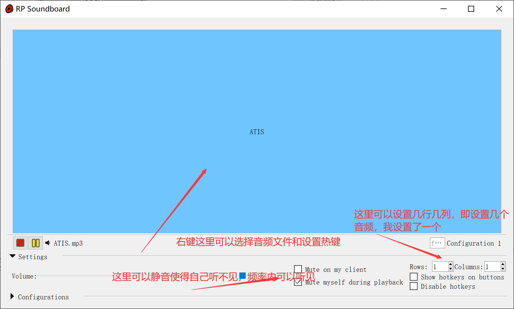
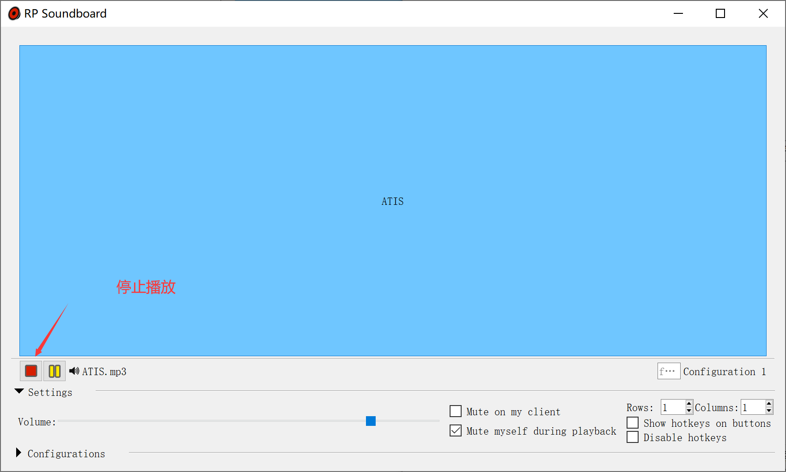
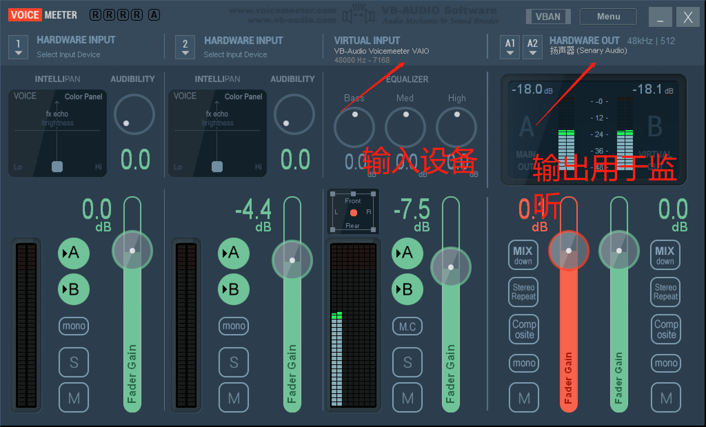

# 模拟飞行ATIS语音生成软件 ATIS-Generator

用于模拟飞行的ATIS自动播报软件，也用于防止放行管制员变成复读机。

项目仓库：https://gitee.com/beamworld/pdc-deliverer

目前已经测试的连飞平台（需以TS为基础的平台）：

- SXC
- ACD
- CFR

——by CFR7445

## 1.开源证书

本软件使用`GPL2.0`作为开源协议，请注意下方所述几点：

1. 您可以自己使用该软件而不受限制；
2. 如您涉及自己使用外的情况，例如分发、修改、盈利等，请严格遵守本软件采用的开源协议；
3. 您可以不接受本软件采用的开源证书，这也意味之您只能本人使用该软件。

## 2.软件功能

以下功能为规划功能，其中已确认的项为当前版本已经实现的功能，未确认的项为规划中将一步步实现的功能。

当前最新版本：`Ver 0.9.9-Beta`

- [x] 离场通播内容设置
- [x] 进场通播内容设置
- [x] 中文通播内容
- [x] 英文通播内容
- [x] 气象播报
- [x] 通播内容试听
- [x] 手动更新通播内容
- [x] 手动更新天气
- [ ] 自动获取天气并更新通播
- [x] 将通播导出为音频
- [x] 向频率循环/单次/停止播放通播
- [ ] 登录到语音服务器（目前无法实现）
- [x] 通播声音、语速、音量调节
- [ ] ATIS信息发送（目前无法实现）

## 3.软件界面

一下界面为展示效果，会根据版本更新产生新变化，请以最新版界面为准。

### 3.1离场通播界面

### 3.2进场通播界面

### 3.3软件设置界面

## 4.使用说明

### 4.1使用准备

#### 4.1.2 安装TS插件rpsoundboard

1. 该插件放置在ATIS Generator/plugin文件夹内，安装它之前确认已安装Teamspeak3。安装完成后需重启Teamspeak3。
2. 连接服务器后，打开rpsoundboard。

3.选择音频文件为ATIS Generator/output/mp/ATIS.mp3，热键设置为F1，设置完可以关闭这个界面。

4. 运行ATIS Generator.exe，在上部选择进场通播或离场通播（只能一个有效），输入相关信息，点击导出音频，导出完毕后点击播放通播，此时频率内开始自动循环播放。
5. 试听通播可以将输入的信息播放一遍，但不向频率内播放。
6. 更新代码会根据当时的时间刷新UTC和通播代码。
7. 要更换通播时的步骤为，输入新的内容------>点击停止通播------>在rpsoundboard界面如下图点击停止解除文件占用------>点击导出音频------>点击播放通播。

请着重注意：

1. 获取天气暂时不可用，功能还未实现。

2. 试听通播为阻塞运行，即只能等待完全播放完才能继续操作软件。

3. 不在rpsoundboard界面如下图点击停止解除文件占用，会导致音频更新失败。

4. 通播播放期间会占用F1键。

5. 该软件需管理员运行。

6. 在CFR论坛使用时遵循以下方法：
   1. 安装虚拟声卡软件Voicemeeter，该软件放置在ATIS Generator/plugin文件夹内。
   2. 如下图设置Voicemeeter的输入设备和输出设备。（设置完成后可以关闭下次使用不用打开软件）
   
   
   
   3. 打开ATC life，设只PTT按键为F1，音频输入为Voice Meeter Input，输出正常设置，登录并上席位。
   4. 运行ATIS Generator.exe，在上部选择进场通播或离场通播（只能一个有效），输入相关信息，点击导出音频。
   5. 使用音频播放器（需要具有可以选择输出设备的播放器）循环导出的音频，这里推荐PotPlayer，该软件放置在ATIS Generator/plugin文件夹内。将音频播放器的输出设置为VB-audio Voice Meeter AVIO，以PotPlayer为例如下图。
   
   
   
   3. 在ATIS Generator上的软件设置界面设置PTT模式为连续按下（这个设置重新打开软件后需重新选择）。
   4. 在ATIS Generator上点击点击播放通播，此时频率内开始自动循环播放。

### 4.2数据填写规范

填写框内容请遵循以下填写规范，当前填写框还没有完善的错误识别机制，故错误的输入方式可能会输出不正常的音频或导致软件错误。

#### 4.1.2离场/进场通播界面

##### 4.1.2.1基本信息

- 机场：下拉菜单选择或四字码输入
- 通播代码：下拉菜单选择或大写字母输入（A~Z）
- 世界时间：下拉菜单选择或整点时间输入，格式示例0000

##### 4.1.2.2运行信息

- 起飞/落地跑道：格式示例36L；多跑道以”，“间隔，格式示例01，36L，通过输入U，可以识别为使用跑道，例如01，U36L，会被读为离场跑道01，使用跑道36L。
  - 不输入也会读出

- 运行模式：下拉菜单选择或手动输入任何内容

##### 4.1.2.3气象信息

- 风向：格式示例030，单位度
- 风速：格式示例02，单位米每秒
  - 不输入风向、风速或输入0可被识别为地面静风，仅输入风速或风向为0识别为不定风。

- 风向变化：风向与风向间逗号间隔（其实可以使用任何符号），格式示例020，070，单位度
  - 不输入则不读出

- 气象：当前不可用
- 云层高度：格式示例2100，单位米(个位和十位在中文读数时将被省略)
  - 不输入则不读出

- 能见度：格式示例6700，单位摄氏度，可输入CAVOK
  - 不输入则不读出

- 温度：格式示例21，单位摄氏度
  - 不输入则不读出

- 露点：格式示例15，单位摄氏度
  - 不输入则不读出

- 修正海压：格式示例1021，单位百帕
  - 不输入则不读出

- 过渡高度：格式示例3000，单位米
  - 不输入则不读出

- 过度高度层：格式示例3600，单位米
  - 不输入则不读出

##### 4.1.2.4管制信息

- 放行/塔台频率：格式示例121.95，单位兆赫兹（小数点后至少写一位，最多写三位）
  - 不输入则不读出

- 离场/进近频率：格式示例121.35，单位兆赫兹（小数点后至少写一位，最多写三位）
  - 不输入则不读出

## 5.待做事项

- [ ] 自动获取天气并更新通播
- [ ] 气象识别
- [x] 英文通播
- [x] 异常处理函数
- [ ] 连接语音服务器

